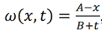

## Burgers Equation Solve

Solving  the Burgers equation:

Solving, where A, B - constants.

Outputs the sequence of dots on the graph. Using implicit finite difference method.

#### MPI

Writing on [MPJ Express](http://mpj-express.org/).

For installation and running see [User guides](http://mpj-express.org/guides.html).

#### OpenMP

Using [omp4j](http://www.omp4j.org/).

How to install and run you can learn from [download page](http://www.omp4j.org/download).
